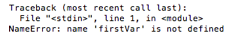
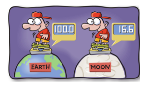

## Week 1 


### FUNCTIONS 
* Make code shorter and easier to read
* Chunks of code that tell Python to do something
* One way of reuse code
* We can use them again and again


### PARTS OF A FUNCTION
* Functions have three parts: a name, parameters and a body. Here is a sample:
```python
def testFunc(myName):
    print('hello %s' % myName)
```
    * **def** is the keyword that defines the function.
    * **testFunc** is the name of the function
    * **myName** is a **parameter** (a variable that exists only while a function is being used)

* To call (or run the code inside the function) is done like this:
```python
testFunc('Jenny'):
```
* Functions can take any number of parameters, not just one. The parameters are separated with a comma.
```python
def testFunc(fName, lName):
    print('hello %s %s' % (fName, lName))
    
testFunc('Jenny', 'Beans'):    
```
* Functions can also return values. The below function takes in 3 parameters, adds the first two and then subtracts the last. 
```python
def savings(pocketMoney, paperRoute, spending):
    return pocketMoney + paperRoute - spending
```
* The result can be assigned to a variable (the same way we assign other variables)  or printed:
```python
savedMoney = savings(10, 10, 5)
print(savings(10, 10, 5))
```

### VARIABLES & SCOPE
```python
def variableTest():
    firstVar = 10
    secondVar = 20
    return firstVar * secondVar
    
print(variableTest())

print(firstVar)
```
* When we tried to print “firstVar” we got the following error because avariable that’s inside a function can’t be used again when the function has finished running because it only exists inside the function (the scope of a variable).  

* If a variable is defined outside of the function, it has a different scope and can be used inside the function and outside of it. 
```python
anotherVar = 100

def variableTest2():
    firstVar = 10
    secondVar = 20
    return firstVar * secondVar * anotherVar
```

### In-class Exercises/Challenges:

* Create a program to calculate our weight on the moon (or any planet):
    * Create function to take the starting weight and increase the weight each year
    * Modify the function so that you can change the amount of years
    * Take input from the user for each and then display how much the user would weigh

### VOCABULARY:
* function 
* parameter 
* scope 

### KEYWORDS:
* def 
* return 
