## Week 2 

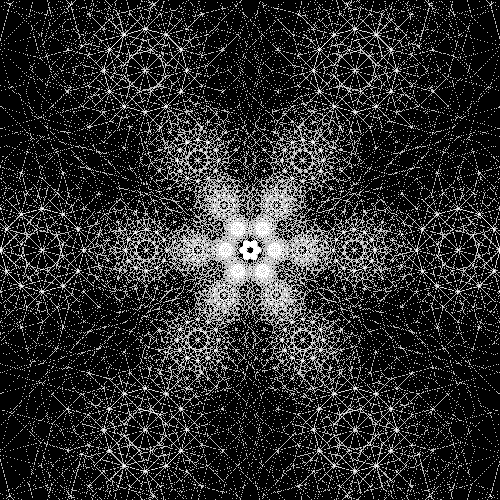

### OBJECTS AND CLASSES IN PICTURES
* When we use **turtle.Pen()** the turtle module uses the Pen class. 
```python
import turtle
donatello = turtle.Pen()
rafael = turtle.Pen()
```
* Now that the objects are created, they become powerful… we can call functions on each and they will move independently (without effecting any of the others)!
```python
donatello.forward(50)
donatello.right(90)
donatello.forward(20)
rafael.left(90)
rafael.forward(100)
```
* Every time we call **turtle.Pen()**, we create a new independent **object**. Since they area all objects of the **Pen** class, we can use the same functions on each **object**… but because they are objects we can move each independently. 
* What happens when we create an object with the same variable name as the one we have already used?

### USING THE TURTLE MODULE
* Before we can use the turtle module we need to **import** the module. Then we must create an instance of the Pen class.
```python
import turtle
donatello = turtle.Pen()
```
* If we run this as is...we will see that as soon as we call the **instance**, a **canvas** is automatically created. The triangle in the window is the turtle. (The triangle points the direction the turtle is facing).

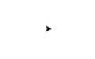

### MOVING THE TURTLE:
* By calling these functions, the turtle can be moved around the screen. Just as we learned last week we call the functions of the class by using the dot after the instance name and then calling the function. This function tells the turtle to move forward 50 pixels:
```python
donatello.forward(50)
```
*  A **pixel** is a single point on the screen – the smallest element that can be represented. (The same as computer monitors and TV Screens... if you zoom in enough you will see the image is made out of dots).

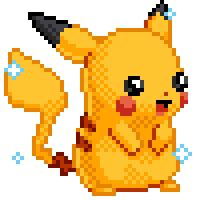

* We can change the direction of the turtle by using the left (or right) function to rotate the turtle by the amount of **degrees** specified.
```python
donatello.left(90)
```
* In this case the turtle rotates 90 degrees to the left. If you are confused about degrees reference the below diagram:

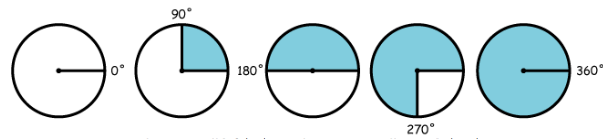

*When you call left(90) it is the same as calling right(270).*
* To erase the canvas, we use the reset function. This will clear the canvas and puts the turtle back at its starting position.
```python
donatello.reset()
```
* You can also use the clear function to erase the canvas. This function **does not** move the turtle back to its starting point.
```python
donatello.clear()
```

### DRAWING SHAPES

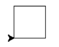

* If you repeat the code below additional times, it will draw a square:
```python
donatello.forward(50)
donatello.left(90)
```
* You can do this simpler by using a **for** loop. We will use reset first to make sure we start at the beginning.
```python
donatello.reset()
for x in range(1,5):
    donatello.forward(50)
    donatello.left(90)
```
* If we change **parameters** in the loop, we can create shapes different from a square.
```python
donatello.reset()
for x in range(1,5):
    donatello.forward(20)
    donatello.left(94)
```
* If we increase the range, the star will have more points. If we increase the number the turtle moves forward, we will increase the length of the star tips. The angle, which we rotate, makes the point skinnier or fatter. The above code looks like this:

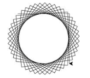

* If we use a function, we can customize the size of the shapes. Here is an example using a square.
```python
def mySquare(size):
    t.reset()
    for x in range(1,5):
        t.forward(size)
        t.left(90)
```
* In this case we use the parameter of our function (size) to change the length in which the turtle draws each side.


### COLORING THINGS IN

* The **color()** function takes three parameters. The first specifies the amount of **red**, the second the amount of **green**, and the last the amount of **blue**. This recipe used to call colors is “RGB”
```python
.color(red, green, blue)
```  
* To get a bright red we use the following code:
```python
donatello.color(1, 0, 0)
```  
* With a 1 in the red parameter, we are telling Python to put 100% red. The 0’s in the green and blue parameters tell Python to use no green and blue.

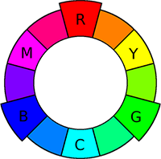

* Red, Green & Blue are primary colors for light. We can’t create them by mixing other colors, but we can create other colors like yellow by mixing them. Here is an example of mixing 100% of red and 100% of green to create a yellow:
```python
donatello.color(1, 1, 0)
``` 
* If we want to use the color black, we would represent this with an absence of any color in the 3 parameters. It would look like this:
```python
donatello.color(0, 0, 0)
``` 
* If we wanted white we add 100% of all colors. This would look like this:
```python
donatello.color(1, 1, 1)
```
###  Some other functions of pen allow us to do different things for example...

* The **up()** function picks up the “pen”, so to speak, and allows us to move the turtle without drawing a line.
    
```python
donatello.up()
```
* The **down()** function puts the “pen” down and allows the turtle to draw when it is moved.
    
```python
donatello.down()
```
* **setheading(headingAngle)** turns the turtle to face a particular direction.

```python
donatello.setHeading(90)
```
* **speed()** allows us to change the speed in which the turtle draws.

```python
donatello.speed(0)
```
* **pensize(size)** allows us to change the thickness of the line that the turtle draws.

```python
donatello.pensize(5)
```
* **pencolor()** allows us to change the thickness of the line that the turtle draws.

```python
donatello.pencolor(1, 0, 0)
```
* [Here is a link to the turtle module reference].(https://docs.python.org/3.3/library/turtle.html?highlight=turtle#module-turtle)

### In-class Exercises/Challenges: 
* Using the turtle class create a generative/fractal design, like this:

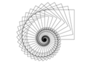

* Draw a box without corners. 
    
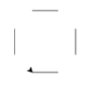

* Draw a triangle.
    
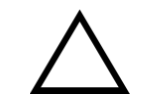

* Draw an 8-sided shape. 
    
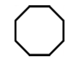

* Draw a filled Octogon.
    
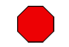

* Create a function to draw a star that will take two parameters: the size and number of points. The beginning of the function will look something like this:

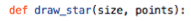 

* Modify the shapes class to allow for the options of changing the fill color, border, size, etc.
* Create a function to navigate through the Maze program.
* Create a class to build a Maze.Using the turtle class create a generative/fractal design.


### VOCABULARY:
* boolean
* canvas
* coordinates
* degrees
* dimensions
* import
* module
* pixel


### KEYWORDS:
* import
* %

### TURTLE KEYWORDS:
* forward
* backward
* left
* right
* reset
* clear
* up
* down
* circle
* setHeading
* begin_fill
* end_fill
* color
* pencolor
* pensize

