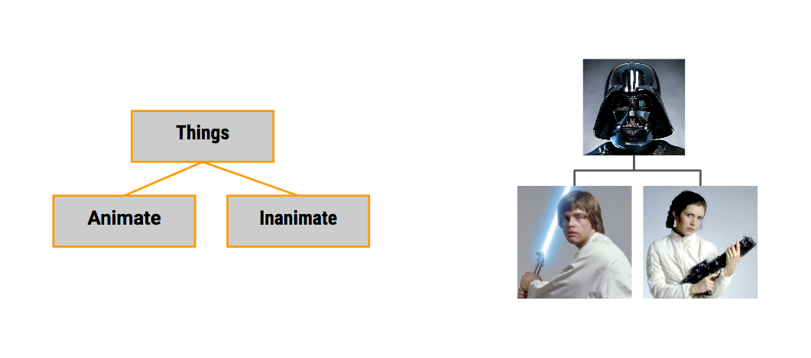

## Week 2 


### CHILDREN & PARENTS
* If a class is part of another class it’s a **child** of that class, and the other class is it’s **parent**. 

* To tell Python that a class is a **child** of another class we add the name of the **parent** in parenthesis after the name of our new class. 
```python
class InAnimate(Things):
    pass
class Animate(Things):
    pass
```

### INHERITED FUNCTIONS
* Each class can use the functions of its parent (and their parents), so the class at the lowest level actually has the least amount of functions because it can use its parent’s functions, and its parent’s parent’s function.


### In-class Exercises/Challenges: 
    * Create a class that can be used for all the drivers used in Mario Kart
    * Create a class that can be used for all the karts used in Mario Kart

### VOCABULARY:
* child 
* parent 
* inherit
