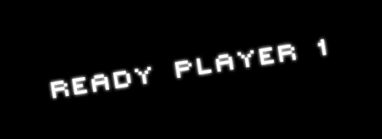

## Week 3 & 4



### BUILDING THE PLAYER ONE MODULE
* First thing we do is create a new document named **player.py**. In this document import the turtle module, so we can access all of the methods & classes.

```python
import turtle
```

* The Player class will be a child of the Turtle object. Because this is a class within a module we need to identify it like this...

```python
class Player(turtle.Turtle):
```

* When we call our player class, we would like it to be all set-up with defaults for us. To do this we we use the __init__ function, also known as a constructor.

```python
class Player(turtle.Turtle):
    def __init__(self):
```

* In addition to initializing the player we also need to initialize the parent class. This allows us automatically set up the turtle when we call our Player class

```python
class Player(turtle.Turtle)
    def __init__(self)
            turtle.Turtle.__init__(self)
```

* Some of the defaults that will be set up in the constructor are: shape of the turtle, if it will draw, what color it will be, and the velocity in which it moves.
```python
def __init__(self):
		turtle.Turtle.__init__(self)
		self.color("blue")
		self.shape("triangle")
		self.penup()
		self.velocity = 1
```

* Next, we can add functions within the class to move the Player.
```python
def move(self):
		self.forward(self.velocity)
```

* Now create a function called **turnLeft()** that will rotate the player turtle 30 degrees every time it is called using the left function. We can do the same for the turning the player right. 

```python
def turnLeft():
    player.left(30)
``` 

* To test our player, make an instance of the Player class in a variable in a **game.py** document. Import our modules, and create an instance of our class. 
```python
import turtle
import player
player = player.Player()
```

* Within a while loop, call a function of the player class, like this:
```python
while True:
	wn.update()
	player.move()
```

### KEYBINDING
* To create an enviornment for keyboard commands, first we need to create another instance of the turtle. This will allow the computer to **listen()** function to tell Python that we will be listening for an **event**, like a key press.
 
```python
t = turtle.Turtle()
t.listen()
```
* Next we are going us the **onkey()** to tell Python to listen for a specific key to be pressed. When the key is pressed it will call the function we specify. In this case we will create a **turnLeft()** function that will be called when the **“Left”** arrow key is pressed. 
```python
t.onkey(player.turnLeft, "left")
```

* You can also assign other functions when different keys are pressed. 

### In-class Exercises/Challenges: 
    * Create a “Player” class that controls a spaceship on the screen. (beginning of alternative version of space invaders)
    * Use Player class to create a 2 player game that controls 2 different spaceships on the screen.
    * Limit the players movement to the viewable screen size/maze boundaries.


### VOCABULARY:
* event
* image
* sprite

### TURTLE KEYWORDS:
* listen
* onkey
* bgpic
* bgcolor
* register_shape
* shape


* Review of Built-in Functions/Modules
    * abs, bool, dir, eval, exec, float, int, len, max, min, range, sum
    * Random - randint, choice, shuffle
    * Sys - exit shell, reading and writing stdin/stdout objects
    * Time - convert asctime, localtime, sleep
    * Math
    * Url
    * Json
* Creating A Custom Module