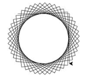

## Week 3

### DRAWING SHAPES

* Last week we made a square, but if we change **parameters** in the loop, we can create shapes different from a square.
```python
donatello.reset()
for x in range(1,5):
    donatello.forward(20)
    donatello.left(94)
```
* If we increase the range, the star will have more points. If we increase the number the turtle moves forward, we will increase the length of the star tips. The angle, which we rotate, makes the point skinnier or fatter. The above code looks like this:



* If we use a function, we can customize the size of the shapes. Here is an example using a square.
```python
def mySquare(size):
    t.reset()
    for x in range(1,5):
        t.forward(size)
        t.left(90)
```
* In this case we use the parameter of our function (size) to change the length in which the turtle draws each side.


* We can use an if statement to control how the turtle will turn and draw another variation.
```python
donatello.reset()
for x in range(1, 19):
    donatello.forward(100)
    if x % 2 == 0:
        donatello.left(175)
    else:
        donatello.left(225)
```
* In this example, we use the expression x % 2 == 0 (or if x mod 2 is equal to 0) to tell us which way the turtle will rotate (left or right). Essentially, the **modulo operator (%)** finds the remainder of x when divided by 2.


### CIRCLES
* To create a circle using code we use the following code:
```python
donatello.circle(50)
```  
* To draw a filled circle, first we need to set the color:
```python
donatello.color(1, 1, 0)
```  
* In this case we set the color to be yellow. Now that the color is set, we must tell Python that we want to fill in the area of the canvas that we are drawing on with that color. We do so by using the **begin_fill()** function, and then drawing the circle by calling the circle function.
```python
donatello.color(1, 1, 0)
donatello.begin_fill()
donatello.circle(50)
donatello.end_fill()
```  
* Finally, we tell Python that we are don filling in the canvas by using the **end_fill()** function.
* If we make a function, we can easily draw filled circles using one command. Here is an
example of a function we would use:
```python
def myCircle(red, green, blue):
    t.color(red, green, blue)
    t.begin_fill()
    t.circle(50)
    t.end_fill()
```  
* Similar to how we made a function for drawing a circle we can do the same for squares. To supply us with more options, lets add a parameter to tell Python if we want the square to be filled or not.
* By using the if statement, if filled is true we will call the function **begin_fill()** and if it isn’t we will not. We will also do the same for the **end_fill()** function. This will allow us the flexibility to draw many different types of squares.
```python
def mySquare(size, filled):
    if filled == True:
        t.begin_fill()
    for x in range(1,5):
        t.forward(size)
        t.left(90)
    if filled == True:
        t.end_fill()
```
* We can also follow this logic when creating a function for drawing a star. See the below example:
```python
def myStar(size, filled):
    if filled == True:
        t.begin_fill()
    for x in range(1, 19):
        t.forward(100)
        if x % 2 == 0:
            t.left(175)
        else:
            t.left(225)
    if filled == True:
        t.end_fill()
```

### In-class Exercises/Challenges: 
* Create a child class of the Turtle class in the module turtle called Shapes.
* Create an __init__ function to set up both the turtle and the shapes class. 
* Add functions to:
    * Draw a square that allows options for where on the screen the shape will be drawn (x position & y position), size, and fill color. 
    * Draw a circle that allows options for where on the screen the shape will be drawn (x position & y position), size, and fill color. 
    * Draw a star that allows options for where on the screen the shape will be drawn (x position & y position), number of points, size, and fill color. 
(Make sure that the turtle does not draw a line when moving to the place that the shapes will be drawn)