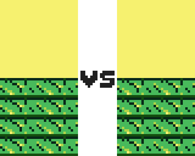

## Week 4



### Setting Boundaries
* If you notice, with the code set up as is the player can navigate off the screen. In order to change that first we need to create a border. To do this we will create a new turtle at the beginning of our code.

 ```python
border = turtle.Turtle()
```

* Use the penup() and setposition() function to place the turtle at the beginning of the border we will be drawing in this case we will be using -300, -300

```python
border.penup()
border.setposition(-300, -300)
```

* After the pen is at the beginning position, we call the pendown() function, change the pensize(), and draw a large square (600 pixels on each side) around the screen using a loop like we did last week.

```python
for side in range(5):
   border.forward(600)
   border.left(90)
```

* Once the border is drawn we can hide the turtle using hideturtle() so it can no longer be seen.

```python
border.hideturtle()
```

### Boundary Checking
* Now that the boundary is drawn, we still need to tell the turtle it cannot pass those lines. This will be done in a function in the main game loop because we will need to constantly.
* In order to check and see if the player’s turtle is on the line we need to pull the coordinates (both x and y) for the player’s turtle. In this case, if the x coordinate is larger than 300 (where the right edge of the border is) or less than -300 (where the left edge of the border is), we can make the turtle turn around by calling the right function and using 180 degrees as the parameter.

```python
if player.xcor() > 300 or player.xcor() < -300:
   player.right(180)
```

* Using the same logic we can do the same for the top and bottom borders using the y coordinate, and the turtle stays within the border!

