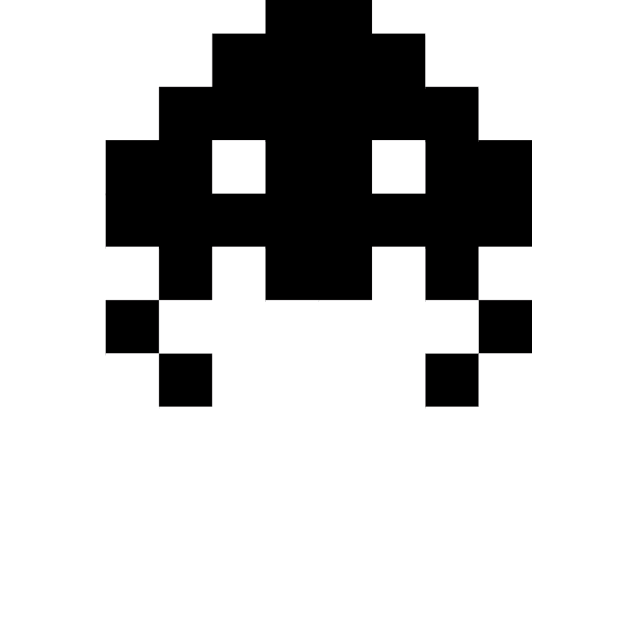
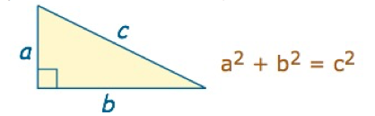
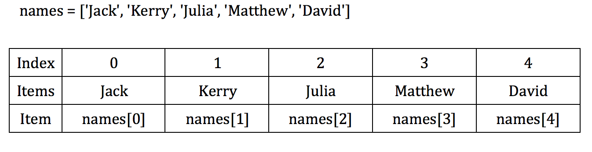

## Week 4



Games need a goal, something that the user is challenged to do. In this game, we will create new document (invader.py), and class called Invaders. Remember to keep all of your documents in the same folder (or directory).

### ADDING INVADERS TO THE GAME:
* To set up our invader, we need to first create another class that is a child of the Turtle Class as we did with the Player class and initialize the class with a constructor. Within the constructor set the default for the color, shape, speed drawn, if the turtle leaves a trail and the velocity in which the turtle travels

```python
import turtle

class Invader(turtle.Turtle):
```

* Then we add characteristics and set-up the invader the invader using the __init__ function. To add variation to the shape of the turtle, shape will be passed as a parameter.

```python
def __init__(self, shape):
   turtle.Turtle.__init__(self)
   self.penup()
   self.speed(0)
   self.shape(shape)
   self.color("blue")
   self.vel = 1
   self.maxVel = 10
   self.setposition(random.randint(-300, 300), random.randint(-300, 300))
```

* Last, let's add a function to make the invader move on the screen. This can be done by using the foward, backward, left and right functions. In this case, I am using the forward function to move the invader at the velocity that was set-up in the initialization of the invader.

```python
def move(self):
   self.forward(self.vel)
```

* If we create an instance of the invader now, and call its move method in the main loop, it will move around just like the Player instance does without the keyboard controls. Now we need to have something happen when the player captures the invader. To do this we need to look into Collision Detection.


### Collision Detection
*  In order to have something happen when the player touches the goal, we need to use a whole lot of math. There are many different ways to do this but in this game we will use the Pythagorean Theorem to measure the distance between these two objects. For this we will need to import the math module in Python.



*  The distance between the objects will be equal to the difference of two x coordinates squared, and the difference of the two y coordinates squared.

```python
d = math.sqrt((math.pow(t1.xcor() - t2.xcor(), 2) + (math.pow(t1.ycor() - t2.ycor(), 2))
```

*  Once we have the distance calculated, we can assign the same logic as we did with the border. If the distance is less than (closer to the goal) a certain amount of pixels, the goal should disappear.

```python
if d < 20:
   invader.hideturtle()
```

*  By using random, we can randomly assign the goal a new position instead of making it disappear.

```python
invader.setposition(random.randint(-300, 300), random.randint(-300, 300))
```
*  This should all happen in the main game loop because we need to constantly check for a collision between the goal object and the player.

### Arrays
* Arrays are fundamental part of most programming languages. It is the collection of elements of a single data type (String, Int, etc.).

```python
array = [1, 2, 3, 4, 5, 6, 7, 8, 9, 20]
array = [A, B, C, D, E]
array = [Mario, Peach, Pikachu]
```

* We can create a Python array with comma separated elements between square brackets[].

```python
array = []
```

* Index is the position of element in an array. In Python, arrays are zero-indexed. This means, the element's position starts with 0 instead of 1.




```python
array = [10, 20, 30, 40, 50]
print(arr[0])
print(arr[1])
print(arr[2])
```

* Python arrays are just lists, so finding the length of an array is equivalent to finding length of a list in Python.

```python
brands = ["Coke", "Apple", "Google", "Microsoft", "Toyota"]
num_brands = len(brands)
print(num_brands)
```

* To add a new element to an array, we use append() method in Python.
```python
add = ['a', 'b', 'c']
add.append('d')
print(add)
```


### Object Arrays
* Instead of creating 50 individual invaders (in the game.py file), we can do it more simply using lists and loops. First we need to import the invader module we just created.

```python
import invaders
```

* We will create a value to store the maximum number of goals we want created and an empty list.

```python
maxInvaders = 10

invaders = []
```

* To create the goals we will be use a for loop with the range of the variable of the maximum number of invaders we want created. Inside the loop we will be creating the an instance of the Invader class, as we did before. This time, by using append,  we will add an invader to the list every time we go through the loop. We will use the count as an index, for reference.

```python
for count in range (maxInvaders):
   invaders.append(Invader("turtle"))
```

*  Now that we have all of the goals created, we must now use a for loop again in the main game loop to animate and contain the goals in the borders.

```python
for invader in invaders:
      invader.move()
```

### Putting Collision Detection In A Function
*  We will have more flexibility in building our game if we put the collision detection into its own function to return a True (there is a collision) or False (there isn’t a collision) outside of the main game loop. This function needs 2 parameters, the player’s turtle and the goal’s turtle. Because they are both objects we can pass both of their x and y coordinates by using the object’s name.

```python
isCollision (t1, t2):
```

*  Within the function, we will put the distance function, and then instead of making the ball randomly position, we will return a True or False.

```python
d = math.sqrt((math.pow(t1.xcor() - t2.xcor(), 2) + (math.pow(t1.ycor() - t2.ycor(), 2))

if d > 20:
   return True
else:
   return False
```

*  To activate the function, we call it inside the main game loop, and randomly reposition the goal when there is a collision.

```python
if isCollision(player, invader):
   invader.setposition(random.randint(-300, 300), random.randint(-300, 300))
   invader.right(random.randint(0,360))
```


